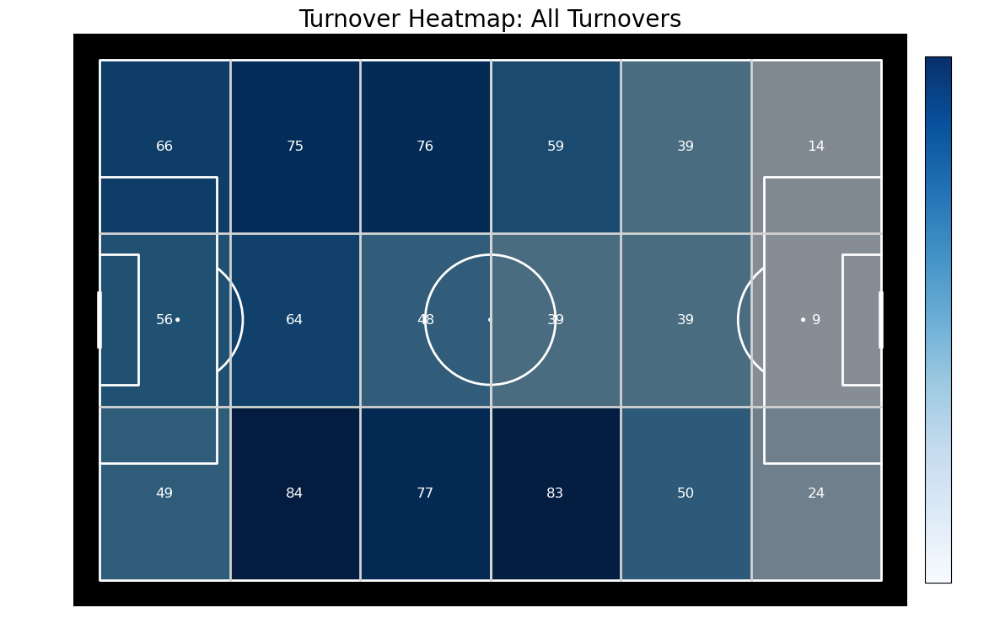

## Technical Showcase
In the 2023/2024 season German team Bayer Leverkusen won their first ever Bundesliga title. And they did it with style, being underdogs and the first and only team to ever go undefeated in the German Bundesliga.
Their success is rooted in focus question of my project, "How did Bayer Leverkusen move the ball up the pitch upon regaining possession?" 

It deals with two key footballing concepts:
1) Turnovers & Transition – Where & how they win the ball.
2) Ball Progression – How they move up the pitch.

I approached the EDA from a geo-spatially and time-series perspective, by doing heatmap isolations of their ball progressions from high yield zones of the pitch where turnovers lead to successful progressions in the same sequence of play.

  

  

  

Over the course of this project, I attained a drastic improvement in model performance. The final model X_6 achieved an impressive accuracy of 82.86%, with balanced precision and recall (83.52%), and most importantly 
an AUC-ROC of 0.91, demonstrating its ability to reliably predict Bayer Leverkusen’s progression into the final sixth after regaining possession. 

  

The model reveals that progressive carries are 21.4% effective than progressive passes in advancing the ball into the final sixths. This underscores Bayer Leverkusen's dynamic style of relationism play in drawing the opposiiton's press using carries down the wing to open oppositions up. The model favored 
longer durations of patient posession. Finally, Leverkusen had the ability to create unbiased penetration from both left and right sides of the pitch in different ways, characterized by long switches of play from Grimaldo on the left defensive zone and explosive dribbles by Frimpong on the right attacking zones.

  

## Specification
This project uses event-based, time series match data from Statsbomb to extract tactical insights into Bayer Leverkusen’s playing style. 
The first part of this personal project incoproates EDA with Python and Panda while visualizing key patterns with matplotlib & mplsoccer (heatmaps, pass networks, shot maps). 
The second part experiments extensively with logistical regression pipelines, predicting what conditions best enabled Bayer Leverkusen's progression into the final sixth of the pitch after regaining possession. 
The models were iteratively refined and improved through normalization, regularization, cross-validation, Confusion matrices, hyperparameter tuning, and evaluation using key metrics like accuracy and AUC-ROC.

